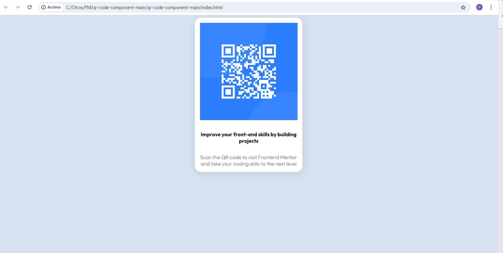

# Frontend Mentor - QR code component solution

This is a solution to the [QR code component challenge on Frontend Mentor](https://www.frontendmentor.io/challenges/qr-code-component-iux_sIO_H). Frontend Mentor challenges help you improve your coding skills by building realistic projects. 

## Table of contents

- [Overview](#overview)
  - [Screenshot](#screenshot)
  - [Links](#links)
- [My process](#my-process)
  - [Built with](#built-with)
  - [What I learned](#what-i-learned)
  - [Continued development](#continued-development)
- [Author](#author)

## Overview

My solution. It´s not perfect, but it´s all I can do with my knowledge.

### Screenshot

### Links

- Solution URL: https://github.com/pgsanchez/FM01_QR
- Live Site URL: https://pgsanchez.github.io/FM01_QR/

## My process

### Built with

- Semantic HTML5 markup
- CSS custom properties
- Flexbox

### What I learned

I learned a bit about flexbox. Just basic things like 

    display: flex;
    flex-direction: column;
    justify-content: center;

### Continued development

I think i have to improve my CSS knowledge, obviously.

## Author

- Website - [pgsanchez.net](https://www.pgsanchez.net)
- Frontend Mentor - [@pgsanchez](https://www.frontendmentor.io/profile/pgsanchez)

